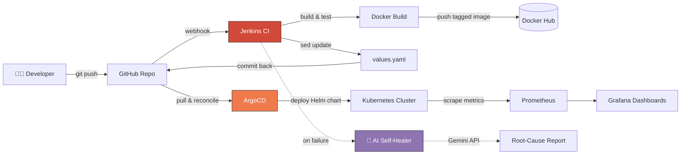

<div align="center">

# 🌩️ Aether-Track

### Agentic AI-Driven DevOps & GitOps Platform

*An enterprise-grade weather analytics platform demonstrating a complete end-to-end GitOps lifecycle, with an AI Self-Healer that diagnoses build failures in real time.*

---


</div>

---

## 📖 Table of Contents

- [Overview](#-overview)
- [Architecture](#-architecture)
- [Key Features](#-key-features)
- [Tech Stack](#-tech-stack)
- [Repository Structure](#-repository-structure)
- [Quick Start](#-quick-start)
- [Monitoring & Observability](#-monitoring--observability)
- [Engineering Decisions](#-engineering-decisions)
- [Roadmap](#-roadmap)
- [Author](#-author)

---

## 🎯 Overview

**Aether-Track** is a weather analytics platform — but the application is the vehicle, not the point. The real project is the **production-grade delivery pipeline** around it.

It solves three common SRE pain points at once:

| Problem | Aether-Track's Answer |
|---------|----------------------|
| 🔄 **Drift between Git and cluster state** | Pull-based GitOps with ArgoCD auto-sync |
| 🐛 **Slow post-failure triage** | AI agent analyzes build logs and proposes fixes |
| 📊 **Observability gaps on custom apps** | ServiceMonitor CRDs + Four Golden Signals dashboards |

---

## 🏗️ Architecture



> The pipeline is **pull-based** (ArgoCD reconciles from Git) rather than push-based — which means the cluster state is always recoverable from version control, and rollbacks are just `git revert`.

---

## ⚙️ Key Features

### 1. 🔁 Automated GitOps Workflow

A true pull-based delivery model where **Git is the single source of truth**.

- **CI (Jenkins):** Builds Docker images, packages Helm charts, applies semantic versioning
- **CD (ArgoCD):** Continuously watches `k8s/aether-app/` and reconciles cluster state to match Git
- **Closed Loop:** Jenkins programmatically updates `values.yaml` on successful image pushes via `sed` — no manual manifest edits, no "it works on my cluster" drift

### 2. 🤖 Agentic AI Self-Healing

A custom AI agent (`ai_healer.py`) that acts as an always-on L1 debugger.

| Stage | What Happens |
|-------|--------------|
| **Trigger** | Automatically fires on any Jenkins build failure |
| **Context** | Parses `build_error.log` and extracts the failure signal |
| **Analysis** | Sends context to Google Gemini with an SRE-tuned prompt |
| **Output** | Delivers root-cause analysis and suggested fix to the engineer |

**Impact:** Cuts Mean Time To Repair (MTTR) by removing the "what even broke?" step from incident response.

### 3. 📡 Full-Stack Observability

Built on the **Prometheus Operator** pattern for declarative, Kubernetes-native monitoring.

- **Custom metrics** exposed via `prometheus-flask-exporter` (request latency, error rates, throughput)
- **Service discovery** via `ServiceMonitor` CRDs — new services are auto-scraped without editing Prometheus config
- **Four Golden Signals** dashboards in Grafana: Latency, Traffic, Errors, Saturation

---

## 🛠️ Tech Stack

| Layer | Tools |
|-------|-------|
| **Application** | Python, Flask, `prometheus-flask-exporter` |
| **Containerization** | Docker (multi-stage builds) |
| **CI** | Jenkins (Multibranch Pipeline) |
| **CD / GitOps** | ArgoCD, Helm |
| **Orchestration** | Kubernetes |
| **Observability** | Prometheus Operator, Grafana, ServiceMonitor CRDs |
| **AI Layer** | Google Gemini API |
| **Registry** | Docker Hub |

---

## 📁 Repository Structure

```
aether-track/
├── app/                      # Python Flask application + weather logic
├── cicd/
│   ├── Jenkinsfile           # Multibranch CI pipeline definition
│   └── ai_healer.py          # AI agent for build-failure analysis
├── k8s/
│   └── aether-app/           # Helm chart
│       ├── templates/        # Deployment, Service, ServiceMonitor
│       ├── values.yaml       # Auto-updated by Jenkins on each build
│       └── Chart.yaml
├── Dockerfile                # Multi-stage optimized build
└── README.md
```

---

## 🚀 Quick Start

### Prerequisites

- Kubernetes cluster (v1.25+)
- Jenkins with `github-creds` and `docker-hub-creds` configured in the Global Credentials store
- ArgoCD installed in the cluster
- `kubectl` and `helm` CLIs locally

### 1. Create the namespace

```bash
kubectl create namespace aether-prod
```

### 2. Provision secrets

```bash
kubectl create secret generic aether-secrets \
  --from-literal=weather-api-key=${WEATHER_KEY} \
  --from-literal=gemini-api-key=${GEMINI_KEY} \
  -n aether-prod
```

### 3. Configure Jenkins

Create a **Multibranch Pipeline** pointing to this repository. Jenkins will auto-discover the `Jenkinsfile` under `cicd/`.

### 4. Register the ArgoCD application

Point a new ArgoCD Application at the `k8s/aether-app/` path with **Auto-Sync enabled**. From there, every commit that Jenkins pushes triggers a reconciliation.

---

## 📈 Monitoring & Observability

The platform ships pre-configured with a `ServiceMonitor` targeting the `http` port of the weather service.

| Component | Value |
|-----------|-------|
| **Prometheus target** | `aether-app-monitor` |
| **Grafana — K8s pods** | Import dashboard ID `14191` |
| **Grafana — Flask metrics** | Import dashboard ID `10751` |

Dashboards cover request rates, p50/p95/p99 latency, error ratios, and pod-level resource saturation.

---

## 🧠 Engineering Decisions

A few deliberate choices made during design, and *why*:

- **No `:latest` tags, ever.** Every image is tagged with the Jenkins build number, making rollbacks deterministic and preventing "mystery deploy" incidents.
- **Resource requests and limits on every container.** Prevents noisy-neighbor CPU saturation and gives the scheduler real information to work with.
- **Helm packaging over raw manifests.** Versioned charts mean rollbacks are a single `helm rollback`, not a hunt through git history.
- **Pull-based over push-based CD.** The cluster asks Git what it should look like, rather than Jenkins telling the cluster. Survives Jenkins outages, survives credential leaks, survives most mistakes.

---

## 🗺️ Roadmap

- [ ] Multi-environment promotion (dev → staging → prod) via ArgoCD ApplicationSets
- [ ] Policy-as-code guardrails with OPA Gatekeeper or Kyverno
- [ ] Chaos testing with LitmusChaos or Chaos Mesh
- [ ] SLO-based alerting with Prometheus recording rules
- [ ] Extend the AI-Healer to act on runtime alerts, not just build failures

---

## 👨‍💻 Author

**Malay Ranjan Panigrahi**
Production Support Engineer → DevOps / SRE in transition
📍 Bangalore, India

[](https://www.linkedin.com/in/malayranjan-panigrahi)
[](https://github.com/malay-ranjan-panigrahi)

---

<div align="center">

*If this project was useful to you, consider leaving a ⭐ — it genuinely helps.*

</div>
